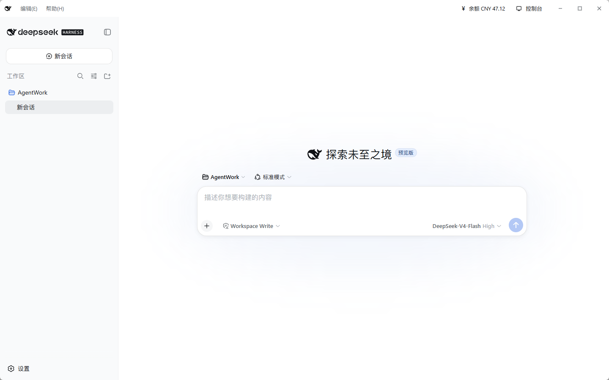
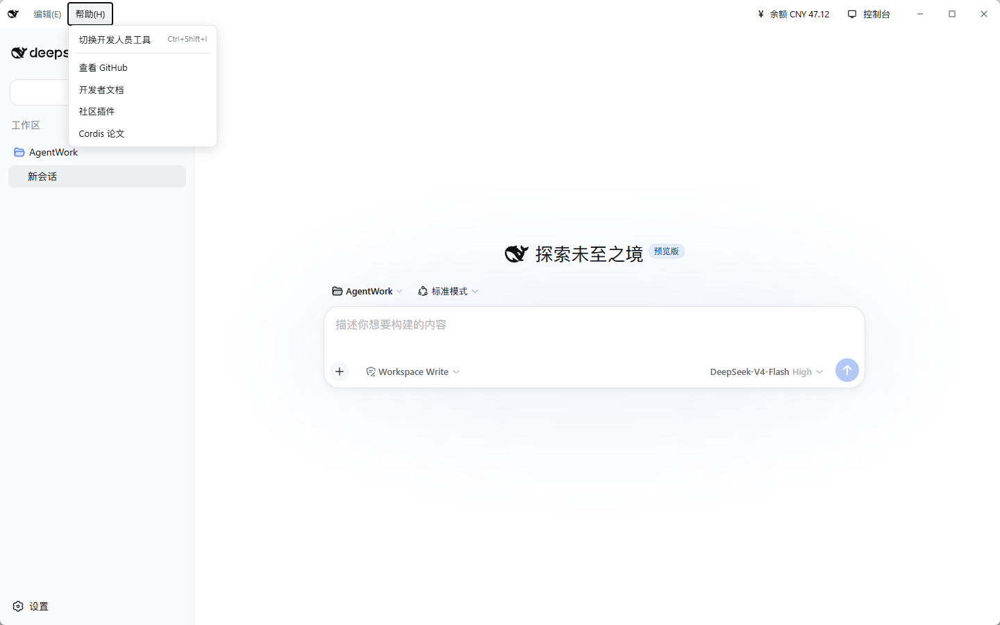
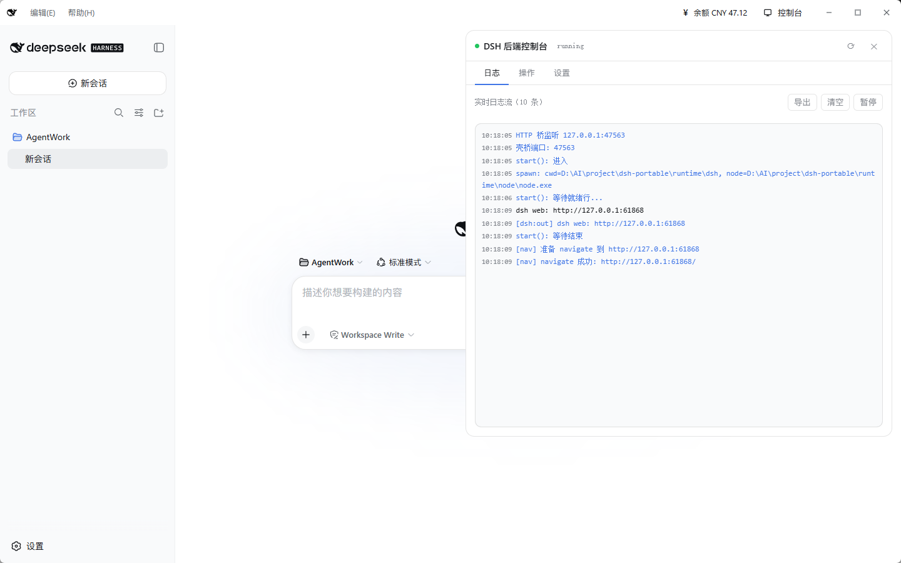

<p align="center">
  
</p>

<h3 align="center">DeepSeek Harness 桌面版</h3>

<p align="center">双击即用的 AI Agent 工作台 — 基于 [DeepSeek Harness](https://github.com/Ringlingo/deepseek-harness) 的便携桌面客户端</p>

<p align="center">
  <a href="#下载">下载</a> ·
  <a href="#功能特性">功能</a> ·
  <a href="#截图">截图</a> ·
  <a href="#从源码构建">构建</a> ·
  <a href="#目录结构">目录</a>
</p>

---

## 下载

从 [GitHub Releases](../../releases) 下载最新版本的 `dsh-desktop-vX.X.X.zip`，解压后双击 `dsh-desktop.exe` 即可使用。

无需安装 Node.js，无需配置环境，零依赖开箱即用。

## 截图

| 启动加载 | 主界面 | 帮助菜单 | 调试控制台 |
|:---:|:---:|:---:|:---:|
|  |  |  |  |

## 功能特性

### 核心体验

- **双击即用** — 内嵌 Node.js + DSH 运行时，无需安装任何依赖
- **便携部署** — 整个应用目录可拷贝到任意 Windows 机器，数据随目录走
- **自动启动** — 双击 exe 自动拉起 DSH 后端并进入工作台

### 标题栏与菜单

- **自定义标题栏** — 鲸鱼图标 + 编辑/帮助下拉菜单 + 余额显示 + 控制台入口
- **编辑菜单** — 撤销、恢复、剪切、复制、粘贴（Ctrl 快捷键）
- **帮助菜单** — 开发者工具、GitHub、文档、社区插件、Cordis 论文
- **窗口控制** — 最小化、最大化、关闭（拖拽标题栏移动窗口）

### 后端管理

- **实时日志** — 控制台面板显示后端 stdout/stderr 流，支持导出/清空/暂停
- **健康检查** — 一键探测端口连通性 + 服务握手
- **进程信息** — PID、内存、版本、运行时路径
- **一键重启** — 后端异常时快速恢复

### 数据与安全

- **数据隔离** — 所有数据存放在 `data/` 目录，不污染用户主目录
- **DSH_HOME** — 环境变量注入，禁止回落到 `~/.dsh`
- **便携可迁移** — 复制整个目录到新机器，会话/配置/密钥原样可用

### 主题与适配

- **主题跟随** — 标题栏自动适配 DSH 深色/浅色主题
- **图标自适应** — 浅色模式显示黑色图标，深色模式自动反转为白色

## 系统要求

- **操作系统**: Windows 10 1809+ / Windows 11 x64
- **WebView2 Runtime**: Windows 10 1809+ 已自带，无需额外安装

## 从源码构建

### 前置要求

- [Rust](https://rustup.rs) 1.77+
- [pnpm](https://pnpm.io/)（用于下载 runtime）
- DeepSeek Harness runtime（node.exe + dsh）

### 步骤

```powershell
# 1. 克隆仓库
git clone https://github.com/yourname/dsh-desktop.git
cd dsh-desktop

# 2. 准备 runtime（从 dsh-portable 或 npm 安装）
# runtime/node/node.exe — Node.js 二进制
# runtime/dsh/ — DSH 核心（@deepseek-ai/dsh + 依赖）

# 3. 编译 exe
cd src-tauri
cargo build --release

# 4. 运行构建脚本（组装完整包）
cd ..
.\scripts\build-release.ps1
```

构建产物在 `release/dsh-desktop/` 目录。

## 目录结构

```
dsh-desktop/
├── dsh-desktop.exe       # 应用程序（~20 MB）
├── ui/
│   └── index.html        # 启动加载页
├── runtime/
│   ├── node/node.exe     # Node.js 运行时（83 MB）
│   └── dsh/              # DSH 核心（255 MB）
│       └── node_modules/@deepseek-ai/dsh/
└── data/                 # 用户数据（首次运行自动创建）
    ├── profiles/         # 插件配置
    ├── sessions/         # 会话数据
    ├── storages/         # 工作区缓存
    ├── settings.yaml     # 应用设置
    └── .credentials.yaml # API 凭据
```

**完整包大小**: ~264 MB（含运行时）

## 技术栈

| 层级 | 技术 |
|------|------|
| 壳 | [Tauri 2](https://tauri.app/) (Rust) |
| 前端 | HTML/CSS/JS 注入（基于 DSH Web UI） |
| 后端 | [DeepSeek Harness](https://github.com/Ringlingo/deepseek-harness) (Node.js + Cordis) |
| 运行时 | Node.js 22.19+ |

## 质量红线

以下规则不可突破：

| # | 红线 |
|---|------|
| R1 | WebView 必须加载 `http://127.0.0.1:PORT` 同源 URL |
| R2 | DSH_HOME 必须指向 `data/`，禁止回落 `~/.dsh` |
| R3 | 退出必须杀干净子进程树 |
| R4 | 版本号从 package.json 读取，不用 `host.describe().version` |
| R5 | 更新必须 SHA256 校验 + 原子替换 + 回滚 |
| R6 | 更新过程不阻塞 UI |
| R7 | 日志不输出敏感信息 |
| R8 | 单实例，不重复启动后端 |
| R9 | 无裸崩溃，统一错误 UI |
| R10 | 启动就绪行解析严格匹配 |
| R11 | 余额凭据仅用于 HTTPS 请求头 |

## 相关项目

- [DeepSeek Harness](https://github.com/Ringlingo/deepseek-harness) — Agent 工具核心
- [Cordis](https://github.com/cordiverse/cordis) — 插件框架
- [Tauri](https://tauri.app/) — 桌面应用框架

## 许可证

[MIT](LICENSE)
