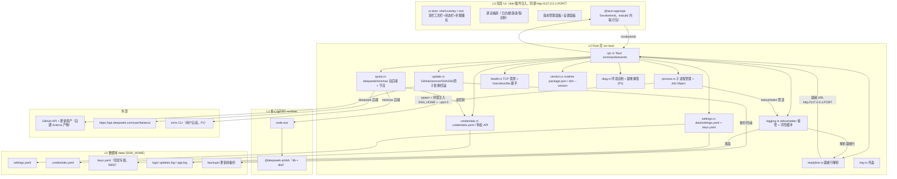
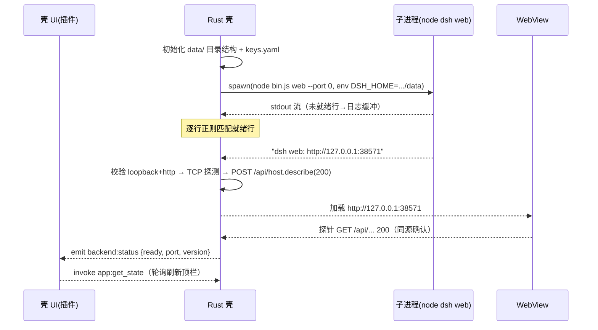
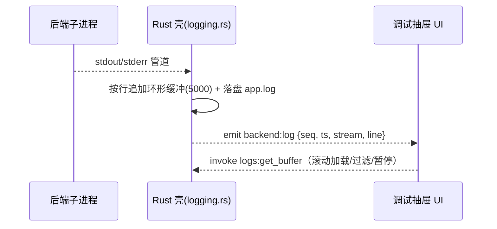
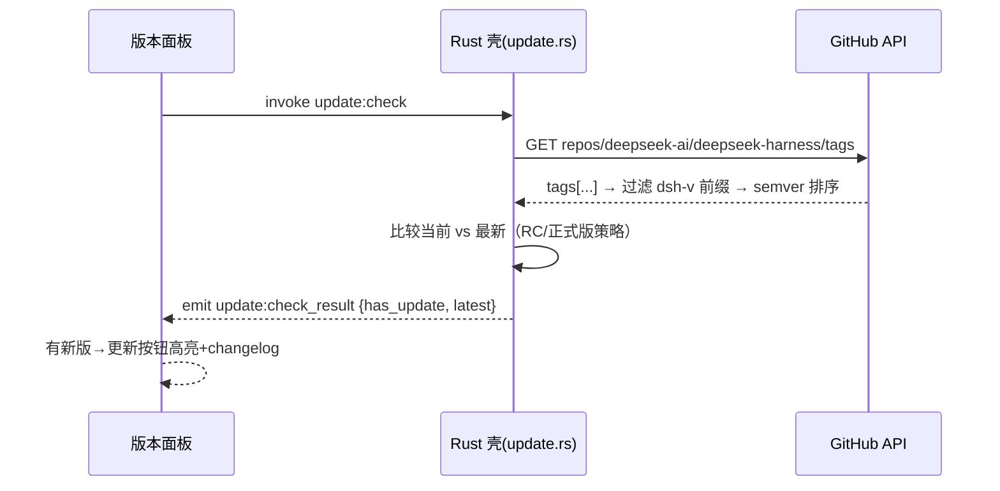
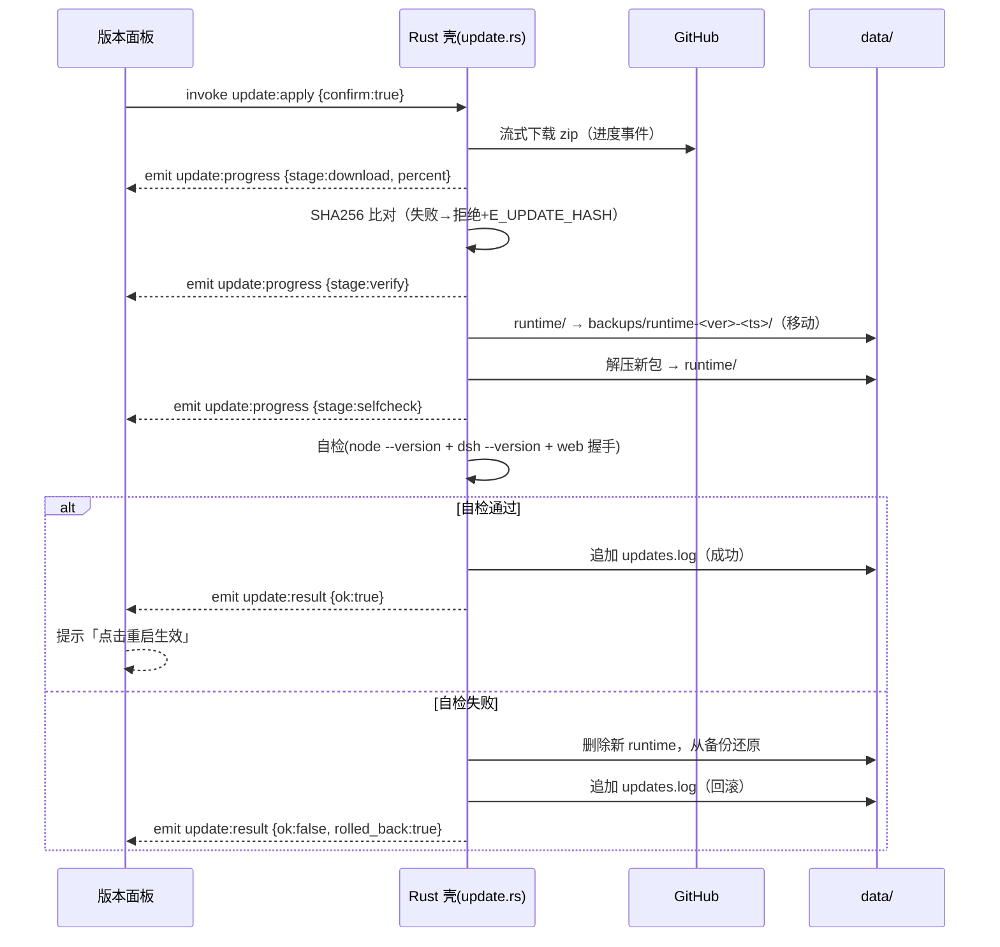
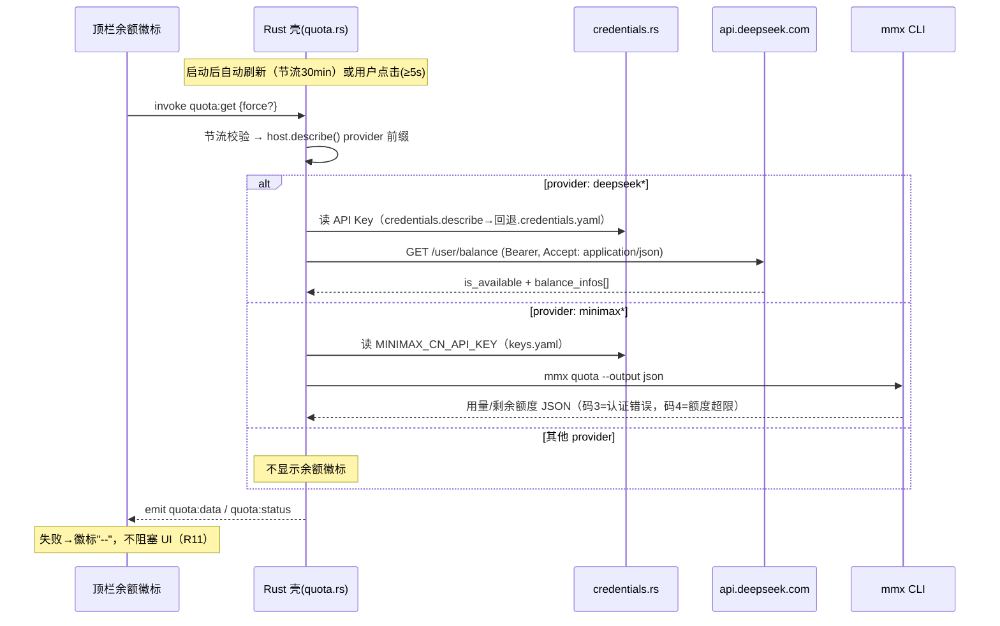

# DeepSeek Harness 便携桌面应用（dsh-portable）系统架构设计

| 项 | 内容 |
| --- | --- |
| 文档版本 | v0.2 |
| 对应 PRD | docs/01-PRD.md v0.2 |
| 架构师 | 高见远（software-architect） |
| 技术栈 | Tauri 2（Rust 壳 + WebView2），Windows 10 1809+/11 x64，Node 22.22.2（内嵌） |
| 状态 | 待评审 |

---

## 1. 架构总览

### 1.1 分层

```
┌─────────────────────────────────────────────────────────────────┐
│  L3 壳层 UI（Shell UI）—— dsh 客户端插件注入，运行于同源页面        │
│   顶栏工具栏 / 状态栏 / 调试抽屉 / 版本面板 / 设置 / 余额徽标        │
│   通过 Tauri IPC（invoke/emit）与 Rust 壳通信                      │
├─────────────────────────────────────────────────────────────────┤
│  L2 Rust 壳（src-tauri，Tauri 2）                                 │
│   进程管理 · 端口发现 · 更新服务 · 余额服务 · 设置 · 托盘 · RPC · 健康 │
│   Windows Job Object 兜底清理 · 单实例 · 统一错误处理              │
├─────────────────────────────────────────────────────────────────┤
│  L1 核心运行时（runtime/，随包分发，与壳彻底分离）                  │
│   node.exe（22.22.2）+ @deepseek-ai/dsh（node_modules 扁平，含 dist）│
│   启动命令：node <runtime>/dsh/node_modules/@deepseek-ai/dsh/lib/bin.js web --port 0 │
├─────────────────────────────────────────────────────────────────┤
│  L0 数据域（data/ = DSH_HOME，进程环境注入）                       │
│   settings.yaml / .credentials.yaml / keys.yaml(壳密钥) /          │
│   profiles/(web: package.json + cordis.patch.yml) / storages/     │
│   sessions/ / attachments/ / .agent-presets/ / logs/ / backups/   │
└─────────────────────────────────────────────────────────────────┘
```

### 1.2 组件图（Mermaid）



---

## 2. Rust 壳模块划分

| 文件 | 职责 | 关键点 |
| --- | --- | --- |
| `main.rs` | 入口、初始化、单实例接入、统一错误页兜底 | panic hook → 错误 UI（R9）；panic 前尽力清理子进程 |
| `app.rs` | `AppState` 全局状态（子进程句柄、端口、版本、日志缓冲、更新/余额状态机、设置缓存） | 用 `tokio::sync::Mutex` 包裹；进程句柄存 `Arc<Mutex<Option<Child>>>` |
| `process.rs` | 启动/重启/终止子进程树；Windows Job Object 兜底；进程信息（PID/RSS/时长） | 见 §3.2 |
| `readyline.rs` | stdout 逐行解析就绪信号 | 严格正则，见 §3.1 |
| `logging.rs` | 接管子进程 stdout/stderr → 环形缓冲 + 事件推送 + 可选落盘 `data/logs/app.log` | 流式、万行滚动不卡顿 |
| `version.rs` | 版本读取：`runtime/dsh/node_modules/@deepseek-ai/dsh/package.json`（主）→ 执行 `dsh --version`（回退）→ 未知 | **禁用** `host.describe().version`（R4） |
| `update.rs` | GitHub API 检查、semver 比较、流式下载、SHA256、备份+原子替换+回滚、更新日志 | 后台线程（F-16/R6）；见 §3.3 |
| `quota.rs` | 余额双后端（deepseek / minimax）、节流、静默降级 | 见 §3.4 |
| `settings.rs` | `data/settings.yaml` 读写；`data/keys.yaml`（0600）存 MiniMax 密钥 | 代理/主题/浏览器/路径覆盖 |
| `credentials.rs` | 读取 `data/.credentials.yaml`；优先经 loopback 特权 API `credentials.describe`，回退本地解析 | 供 quota.rs 取 DeepSeek key |
| `health.rs` | TCP 端口探测 + `POST /api/host.describe` 握手 + 事件流连通性 | 握手返回的 `version:'0.0.1'` 仅做连通判断（R4 注释） |
| `tray.rs` | 托盘图标、菜单（显示/调试/检查更新/退出）、关窗最小化 | 与 F-03/Q3 决策一致 |
| `diag.rs` | P1：环境诊断（node 版本/端口/磁盘/DSH_HOME 可写）+ 疑难解答扫描 | F-17/F-18 |
| `rpc.rs` | Tauri commands 注册 + 事件路由 + 统一错误类型 `AppError` | 命令清单见 §4.1 |
| `error.rs` | 统一错误枚举 + 错误码映射，前端一律走错误 UI | R9 |

---

## 3. 关键设计决策（决策 / 理由 / 备选）

### D1 WebView 加载策略：仅同源就绪 URL（R1 硬约束）

- **决策**：WebView 仅加载 readyline 解析出的 `http://127.0.0.1:PORT`。加载前强制校验：scheme=`http`、host∈{`127.0.0.1`}、端口来自就绪行；加载后探针 `GET /api/host.describe` 期望 200。
- **理由**：DSH 前端需与 `/api/*` 同源，否则 403（R1）；`--port 0` 由 OS 分配避免端口冲突（F-22）；禁 `file://` / 自定义 scheme 保证安全边界。
- **备选**：固定端口 3080（被占即失败，否决）；`file://` 壳 UI + iframe 嵌远端（/api 跨源 403，否决）。

### D2 壳层 UI 形态：全部以 dsh 客户端插件注入（含顶栏/三栏/余额徽标）

- **决策**：壳层 UI 不另起 `file://` 页面，而是打包为一个 **dsh 客户端插件**（`dsh-portable-shell-ui`），经 `window.__DSH_BOOT__` 注入 `/plugins/dsh-portable-shell-ui/client.js`，用 `ui-slots`（`shell.overlay`/`root`/`sidebar`/`details`/`conversation`）挂载顶栏工具栏、三栏、调试抽屉、余额徽标。该插件注册进 `data/profiles/web`（package.json + cordis.patch.yml），由 dsh 同源服务，天然满足 R1。
- **理由**：① R1 下任何壳 UI 都必须同源，dsh 插件机制是官方同源注入通道，不碰官方 dist（F-07 要求）；② 数据经 Tauri IPC（invoke/emit）从 Rust 壳取，`@tauri-apps/api` 由 esbuild 内联进 client.js，WebView 加载远端 URL 时 Tauri 仍注入 IPC 桥，链路成立；③ 更新只换 `runtime/`，壳 UI 插件在 `data/`，可独立演进。
- **备选**：
  - A. Tauri 多 webview overlay 顶栏（独立窗口加载另一 URL）——dsh 无独立静态路由，需改 dist，否决。
  - B. 壳 UI 用独立 WebviewWindow 加载 `http://127.0.0.1:PORT/debug` —— dsh webserver 无该路由，404，否决。

### D3 余额徽标位置：随顶栏做 dsh 插件注入（推荐），不做独立壳层 overlay

- **决策**：余额徽标作为顶栏插件 UI 的一部分由 dsh 插件注入（D2 同一注入面），数据源为 `invoke('quota:get')`，由 Rust `quota.rs` 决定 provider 路由与节流。
- **理由**：① 数据天生在 Rust 壳（HTTP/MMX 在壳侧），UI 只需消费事件；② R1 下不存在"独立壳层 overlay"可行实现（见 D2 备选否决），插件注入是唯一不破坏同源的方式；③ 统一注入面，顶栏组件复用同一渲染上下文，避免两套定位/层级协调；④ 失败时该徽标 UI 静默置 `--`，符合 R11。
- **备选**：壳层顶栏 overlay（独立窗口/多 webview）——受 R1 约束不可行；数据前移 WebView 内直接调 `/api`（无凭据读取权限、破坏 R7），否决。

### D4 进程树清理：Job Object `KILL_ON_JOB_CLOSE` + 显式终止

- **决策**：spawn 后端时用 `CREATE_SUSPENDED` 创建进程，立即 AssignProcessToJobObject，再 Resume。Job 设 `JOB_OBJECT_LIMIT_KILL_ON_JOB_CLOSE`：壳进程死亡（含强杀）时 OS 自动杀整棵树；正常退出路径显式 `taskkill /T /F`（按 PID，兼容 node-pty 衍生的 shell）+ 等待句柄 + 兜底重试。
- **理由**：node-pty 会在后端进程树内再衍生 shell，仅杀父进程不干净（R3）；Job Object 在"壳被强杀"路径仍兜底（PRD 强制路径要求）。
- **备选**：只依赖 `taskkill /T`（强杀壳进程时无兜底，否决）；遍历进程链表按父进程关系杀（竞态窗口大，否决）。

### D5 就绪行解析：严格白名单正则（R10）

- **决策**：对 stdout 每行执行 `^dsh web: (http://127\.0\.0\.1:\d{1,5})$`，且附加校验：端口∈[1024,65535]、加载前 TCP 连通 + `host.describe` 握手成功才进入"就绪"；非就绪行仅进日志流。
- **理由**：dev server / 插件可能输出形似行（R10 防御）；握手双重确认避免"端口开了但服务未就绪"。
- **备选**：弱匹配（含 `http://127.0.0.1` 即就绪）——误报风险，否决。

### D6 更新原子替换：备份 + 替换 + 自检 + 提交（R5）

- **决策**：更新流程（后台线程）：
  1. 流式下载更新包到 `data/downloads/*.tmp`（半包可重试，不落半包）；
  2. 计算 SHA256 与清单比对，不匹配即拒绝；
  3. 将 `runtime/` 整体移动到 `data/backups/runtime-<ver>-<ts>/`；
  4. 解压新包到 `runtime/`（保持 node + dsh node_modules 扁平布局）；
  5. **自检**：spawn 新 node 跑 `--version` + `dsh --version` + 短时启动 web 握手；通过 → 写 `data/logs/updates.log` 提交；失败 → 删除新 runtime，从备份还原，记录"回滚"。
- **理由**：任何时刻存在可用版本（R5）；"移动备份"而非"复制备份"省一半磁盘与时间；自检通过才提交避免"已替换但不可用"。
- **备选**：复制式备份（耗时翻倍、大包 1.4G 场景不可接受，否决）；仅覆盖不备份（无回滚，否决）。
- **资产形态（Q1 默认）**：本项目自建 GitHub Actions 流水线，产出 `dsh-portable-runtime-v<ver>-<rc>.zip` + `sha256sums.txt`，tag 前缀 `dsh-v<semver>` 对齐上游。

### D7 余额凭据读取：壳层特权 API 优先，本地文件回退 + 脱敏（R7/R11）

- **决策**：DeepSeek API Key 经 loopback 特权 API `credentials.describe` / `settings.describe` 从 `data/.credentials.yaml` 读取；调用失败（未启动/无权限）时回退为壳直接解析 `.credentials.yaml`。MiniMax 密钥存 `data/keys.yaml`（0600，不进 settings.yaml，规避 `.env` 写入限制与 R2）。所有密钥仅用于 HTTPS 请求头 / `mmx auth login` 参数，绝不进日志（R7 抽样扫描）。
- **脱敏要求（用户 Q7 已确认）**：`keys.yaml` 存储加密脱敏——用 **Windows DPAPI（CryptProtectData/CryptUnprotectData，经 windows-sys）** 加密后落盘，明文不落盘；UI 与日志对密钥仅显示尾 4 位；`quota:configure_minimax` 命令写入后不回显密钥；解密失败（换机器/权限变更等）时静默降级余额为 `--` 并提示重新配置。
- **MMX 接入形态（用户 Q6 已确认）**：余额能力可插拔——① 默认以 **dsh 客户端插件**（`dsh-portable-shell-ui`，D2 同一注入面）承载 UI；② MMX 交互层（`mmx quota` 执行与解析）封装为独立模块，后续可暴露为 **MCP server**（`mmx` 工具）供其他客户端复用；壳层 `quota.rs` 保持 provider 前缀路由，不绑定具体形态。
- **理由**：`DSH_` 前缀变量不能写 `.env`（R2 硬约束）；凭证集中管理、随 data/ 便携；日志零泄露是质量红线。
- **备选**：密钥放 settings.yaml（明文风险 + 违背"密钥不落普通配置"惯例，否决）。

### D8 WebView-壳通信通道：Tauri IPC（invoke / event）

- **决策**：壳 UI ↔ Rust 壳全部走 Tauri `invoke`（命令）与 `emit/listen`（事件）。命令为强类型入参出参（§4.1），事件有 JSON schema（§4.2）。禁止壳 UI 直接调 dsh `/api`（F-26 凭据不经前端）。
- **理由**：Tauri 官方 IPC 在加载远端 URL 的 WebView 同样注入桥；类型安全、可测试、无额外服务。
- **备选**：WebSocket/SSE 转发（重复造轮子、无类型，否决）；`window.__DSH_BOOT__` 全局回调互调（无法跨 dsh 插件边界，否决）。

### D9 dsh 插件注入路径（F-07 三栏 / F-06 顶栏 / 余额徽标）

- 插件包 `dsh-portable-shell-ui`：`package.json` 声明为 dsh client plugin；入口 `client.js` 经 `window.__DSH_BOOT__.plugins.push({ id, setup() {...} })` 注册 `ui-slots` provider：
  - `shell.overlay` → 顶栏工具栏（状态灯/端口/版本/余额徽标/调试开关/重启/更新按钮）；
  - `sidebar` → 左侧导航（会话/工作区/模型/插件/设置/更新）；
  - `details` → 右侧工具区（待办/产物/参考信息）；
  - `root` → 调试抽屉与错误遮罩、设置/版本面板弹层。
- 注入脚本经 esbuild 打包为单文件（含内联 `@tauri-apps/api`），由 dsh 在 `/plugins/dsh-portable-shell-ui/client.js` 同源提供。
- **回退**：插件加载失败（如 dsh 升级破坏机制）→ 壳检测到 UI 未挂载超时（5s），进入"最小可用"：仅 WebView 正常加载官方前端 + 顶栏状态经 Tauri 原生菜单项兜底，并在日志提示。

### D10 日志获取方式（F-08）

- **决策**：cordis Logger 不输出 stdout，因此日志**不依赖 dsh 接口**，由 Rust 壳直接接管子进程 stdout/stderr 管道，按行加时间戳+来源（out/err）进环形缓冲（默认 5000 行），事件 `backend:log` 推前端；导出经 `logs:export` 写 `data/logs/app.log`。
- **理由**：100% 捕获、零依赖后端行为（F-08 验收①）；环形缓冲控内存。

---

## 4. 数据结构与接口

### 4.1 Tauri Commands 清单

| 命令 | 入参 | 出参 | 说明 | 对应 |
| --- | --- | --- | --- | --- |
| `app:get_state` | `-` | `AppStateView { backend_status, port, version, dsh_home, uptime_ms }` | 启动后轮询 ≤1s 刷新顶栏 | F-06/F-12 |
| `backend:restart` | `{ force?: boolean }` | `{ ok: boolean }` | 重启需前端二次确认后调用 | F-03/F-21 |
| `backend:get_process` | `-` | `ProcessInfo { pid, rss_bytes, start_ts, node_version, dsh_home }` | 每秒刷新（前端控制节流） | F-10 |
| `health:check` | `-` | `HealthResult { tcp: boolean, handshake: boolean, event_stream: boolean, latency_ms, ts }` | 逐项 ✓/✗ | F-09 |
| `logs:get_buffer` | `{ offset?: number, filter?: string }` | `LogChunk { seq, lines: LogLine[] }` | 环形缓冲游标读取 | F-08 |
| `logs:clear` | `-` | `{ ok }` | 清内存缓冲（不影响落盘） | F-08 |
| `logs:export` | `{ path?: string }` | `{ file: string, count: number }` | 默认写 `data/logs/app.log` | F-08 |
| `logs:subscribe` | `-` | `-` | 事件订阅开关（事件：`backend:log`） | F-08 |
| `devtools:toggle` | `{ enabled: boolean }` | `{ enabled }` | WebView DevTools；分发版默认关 | F-11 |
| `update:check` | `{ silent?: boolean }` | `UpdateInfo { current, latest, has_update, release_notes?, error? }` | GitHub API + semver 比较 | F-13/F-20 |
| `update:apply` | `{ confirm: true }` | `{ ok, stage }` | 后台线程执行，进度经 `update:progress` | F-14/F-16 |
| `update:log` | `{ limit?: number }` | `UpdateLogEntry[]` | 读 `data/logs/updates.log` | F-15 |
| `quota:get` | `{ force?: boolean }` | `QuotaData \| null` | 手动刷新（≥5s 节流）；自动 30min | F-26 |
| `quota:configure_minimax` | `{ api_key, region?, action?: 'login'\|'clear' }` | `MmxResult { ok, message, code? }` | 存 keys.yaml + mmx auth login | F-27 |
| `settings:get` | `-` | `Settings { proxy, theme, browser_behavior, paths_override }` | 读 settings.yaml | F-19 |
| `settings:set` | `{ key, value }` | `{ ok }` | 写 settings.yaml + 事件 `settings:changed` | F-19 |
| `diag:run` | `-` | `DiagnosticItem[]` | node 版本/端口/磁盘/DSH_HOME 可写 | F-17 |
| `troubleshoot:scan` | `-` | `TroubleItem[] { id, severity, found, fixable, suggestion }` | ≥5 类问题扫描 | F-18 |
| `app:open_external` | `{ url }` | `{ ok }` | 外链走系统浏览器（遵循设置） | F-19 |
| `app:get_plugin_list` | `-` | `PluginItem[]` | 读 `data/profiles/web/package.json` 依赖 | F-24(P2) |

### 4.2 前后端事件契约（JSON Schema 摘要）

```json
// backend:log —— 日志流
{ "seq": 1024, "ts": "2026-08-15T10:20:30.123Z", "stream": "out|err", "line": "..." }

// backend:status —— 后端状态
{ "status": "starting|ready|error|stopped", "port": 38571, "version": "0.1.0-rc.5",
  "ready_url": "http://127.0.0.1:38571", "at": "..." }

// backend:exit —— 进程退出
{ "pid": 1234, "code": 1, "signal": null, "unexpected": true }

// health:result —— 健康检查（也可由 command 返回值）
{ "tcp": true, "handshake": true, "event_stream": true, "latency_ms": 23, "ts": "..." }

// update:check_result
{ "current": "0.1.0-rc.5", "latest": "0.1.1", "has_update": true,
  "release_notes": "...", "error": null }

// update:progress —— 阶段进度
{ "stage": "download|verify|backup|replace|selfcheck|rollback|done|failed",
  "percent": 62, "bytes": 123456, "total": 200000, "message": "正在下载…" }

// update:result
{ "ok": true, "from": "0.1.0-rc.5", "to": "0.1.1", "rolled_back": false,
  "sha256": "…", "at": "..." }

// quota:data —— 余额数据
{ "provider": "deepseek|minimax", "currency": "CNY",
  "available": true,
  "total_balance": 12.34, "granted_balance": 5.0, "topped_up_balance": 7.34,
  "used": 2.1, "remaining": 10.24,
  "source": "deepseek-official|mmx-cli", "ts": "..." }

// quota:status —— 余额状态机（失败静默，仅前端可查）
{ "state": "ok|unconfigured|failed|throttled", "last_error": "auth_failed", "retry_after_s": 295 }

// settings:changed —— 设置变更广播
{ "key": "proxy.http", "value": "http://127.0.0.1:7890" }
```

### 4.3 错误码（AppError → 前端错误 UI）

| 错误码 | 含义 | 建议 UI |
| --- | --- | --- |
| `E_STARTUP_TIMEOUT` | 30s 未就绪 | 错误页 + 「查看日志/重启」 |
| `E_READY_PARSE` | 就绪行解析失败 | 错误页 + 日志入口 |
| `E_UPDATE_HASH` | SHA256 不匹配 | 版本面板报错，拒绝安装 |
| `E_UPDATE_ROLLBACK` | 替换后自检失败，已回滚 | 提示「已回滚到原版本」 |
| `E_NODE_MISSING` | runtime/node.exe 缺失 | 环境诊断引导 |
| `E_BACKEND_CRASHED` | 后端异常退出 | 顶栏红灯 + 恢复引导（F-21） |
| `E_WEBVIEW2_MISSING` | WebView2 Runtime 缺失 | 下载指引（非白屏） |
| `E_QUOTA_FAIL` | 余额查询失败 | 静默降级 `--`（R11） |

---

## 5. 时序图（Mermaid）

### 5.1 启动就绪



### 5.2 日志流



### 5.3 检查更新



### 5.4 一键更新



### 5.5 余额刷新



---

## 6. 文件清单（相对仓库根）

```
src-tauri/
  Cargo.toml
  tauri.conf.json
  src/
    main.rs
    app.rs
    process.rs
    readyline.rs
    logging.rs
    version.rs
    update.rs
    quota.rs
    settings.rs
    credentials.rs
    health.rs
    tray.rs
    diag.rs
    rpc.rs
    error.rs
shell-ui/                                    # 壳层 UI（dsh 客户端插件源码）
  package.json
  src/
    client.ts                               # __DSH_BOOT__ 注册
    slots/
      topbar.tsx                            # 顶栏工具栏 + 余额徽标
      sidebar.tsx                           # 左侧导航
      details.tsx                           # 右侧工具区
      debugDrawer.tsx                       # 调试抽屉
      panels.tsx                            # 设置/版本/余额详情
    bridge.ts                               # invoke/emit 封装
  scripts/build.mjs                         # esbuild 单文件打包 → dist/client.js
  dist/client.js                            # 产物（注入包）
data/profiles/web/                          # 运行时生成的 dsh profile
  package.json                              # 依赖声明（含 dsh-portable-shell-ui）
  cordis.patch.yml                          # 插件注册 patch
scripts/
  prepare-runtime.mjs                       # 首次初始化 runtime/dsh 布局（node_modules 扁平）
  build-update-pack.mjs                     # 打包更新资产（zip + sha256sums）
  ci/
    publish-update.yml                      # GitHub Actions：产更新包+发布 release
    test-rust.yml                           # CI：cargo test + 红线演练
tests/                                      # Rust 集成测试（壳级）
  integration/
    startup_cleanup.rs
    update_rollback.rs
    readyline_parse.rs
docs/
  01-PRD.md
  02-architecture.md
  03-plan.md
```

---

## 7. 依赖包列表

### Rust crates（`src-tauri/Cargo.toml`）

| crate | 用途 | 说明 |
| --- | --- | --- |
| `tauri = "2"` | 壳框架 | 含 webview、window、IPC |
| `tauri-plugin-single-instance` | 单实例（F-04/R8） | 二实例发聚焦信号 |
| `tauri-plugin-window-state` | 窗口尺寸/位置记忆（F-25） | P2 可后加 |
| `tauri-plugin-dialog` | 文件对话框（离线更新/导出） | P2 用到 |
| `reqwest`（rustls-tls） | GitHub API / DeepSeek / 下载 | 关闭 native-tls，纯 rustls 减小依赖 |
| `sha2` | SHA256 校验（F-14/R5） | |
| `hex` | hash 显示 | |
| `semver = "1"` | 版本比较（F-13） | 含 prerelease 规则 |
| `serde` / `serde_json` / `serde_yaml` | 序列化、事件、settings.yaml | |
| `tokio`（full） | 异步、子进程、后台线程 | |
| `job_object`（或 `windows` crate JobObject 子集） | Windows Job Object（R3） | `KILL_ON_JOB_CLOSE` |
| `sysinfo` | 进程 PID/RSS（F-10） | |
| `anyhow` / `thiserror` | 错误处理、统一 `AppError` | R9 |
| `regex` | 就绪行/日志解析（R10） | |
| `url` | 就绪 URL 校验（R1） | |
| `chrono` / `time` | 时间戳（日志/更新日志） | |

> 注意：Rust 壳**不需要** node-pty（那是 dsh 内部能力）；壳直接 CreateProcess spawn node.exe，进程树清理走 Job Object。

### 前端 / 插件侧（shell-ui）

| 包 | 用途 | 说明 |
| --- | --- | --- |
| `@tauri-apps/api` | invoke/emit（构建时内联） | 经 esbuild 打进 client.js |
| `esbuild`（dev） | 单文件打包 | 产 `dist/client.js` |
| `typescript`（dev） | 类型 | |

---

## 8. 共享知识 / 约定

### 8.1 命名与目录约定

- 目录：`src-tauri/`=壳代码；`runtime/`=node+dsh（只读、随更新整体替换）；`data/`=DSH_HOME（可写、便携、不可提交到 VCS）；`data/logs/`=app.log、updates.log；`data/backups/`=更新前备份；`data/downloads/`=更新临时下载；`data/keys.yaml`=壳层密钥（0600）。
- 子进程：统一由 `process.rs` 创建；禁止其他模块直接 spawn；重启必须完整走 terminate→wait→spawn。
- 版本：唯一来源 `runtime/dsh/node_modules/@deepseek-ai/dsh/package.json`；壳内以 `Version` 结构体持有。
- 事件名：`domain:action` 蛇形小写（如 `backend:status`、`update:progress`）；命令名 `domain:action`（`quota:get`）。
- 错误码：`E_<DOMAIN>_<REASON>`，全部集中 `error.rs`，前端只按码渲染。

### 8.2 质量红线编码（R1-R11 对应实现位置）

| 红线 | 实现位置 |
| --- | --- |
| R1 同源加载 | `readyline.rs` + `rpc.rs`（加载前校验 + 加载后探针） |
| R2 数据隔离 | `app.rs` 初始化 + `process.rs` env 注入；CI 代码审查禁回落分支 |
| R3 清理 | `process.rs` Job Object + taskkill 双保险 |
| R4 版本可信 | `version.rs`（禁 host.describe().version） |
| R5 更新安全 | `update.rs`（校验+备份+原子替换+自检+回滚） |
| R6 不阻塞 UI | `update.rs` 后台线程 + 事件推送 |
| R7 日志无敏感 | `logging.rs` 过滤规则 + CI 抽样扫描 |
| R8 单实例 | `tauri-plugin-single-instance` + 后端锁 |
| R9 无裸崩溃 | `main.rs` panic hook + `error.rs` 统一错误页 |
| R10 解析严格 | `readyline.rs` 白名单正则 + 握手确认 |
| R11 余额安全 | `quota.rs`/`credentials.rs` 只进请求头；失败静默 `--` |

---

## 9. 待明确事项（架构侧）

1. **Q1 更新资产**：需与上游/项目方确认自建 Actions 产出的更新包**目录布局**是否与本地 `runtime/` 完全一致（node 版本、node_modules 扁平化、原生模块平台），否则替换逻辑需加"布局迁移"步骤。
2. **Q6 MMX-CLI 形态**：首版用户自装 → `quota.rs` 依赖 PATH 中的 `mmx`；需确认 `mmx quota --output json` 的字段名与退出码语义（3=认证、4=额度超限）是否稳定，是否需要先 `mmx auth status` 探测。
3. **dsh 客户端插件加载**：`window.__DSH_BOOT__` / `ui-slots` 的注入契约需在开发早期用真实 DSH 实例验证（plugin id 注册、client.js 的 serve 路径、slot 挂载 API），防止 rc.6 与 rc.5 契约差异导致 D2 方案返工。
4. **更新包体积与分发**：1.4G 全量分发的下载策略（断点续传、镜像/代理支持），以及 GitHub release 单文件 2G 上限是否满足（Q4）。
5. **`credentials.describe` 特权 API 的鉴权**：loopback 调用是否需要管理令牌/header；回退本地解析 `.credentials.yaml` 的格式（加密与否）。
