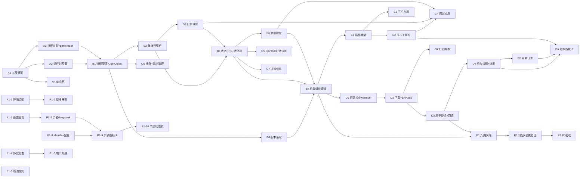

# DeepSeek Harness 便携桌面应用（dsh-portable）实施计划

| 项 | 内容 |
| --- | --- |
| 对应文档 | docs/01-PRD.md v0.2、docs/02-architecture.md v0.2 |
| 计划版本 | v0.2 |
| 状态 | 待评审 |

---

## 1. P0 任务列表（按实现顺序）

### 阶段 A：工程骨架

| # | 标题 | 输入 | 产出文件 | 验收标准 | 复杂度 |
| --- | --- | --- | --- | --- | --- |
| A1 | Tauri 2 工程初始化 + 三分离目录 | 架构文档 §1 | `src-tauri/Cargo.toml`、`tauri.conf.json`、`src-tauri/src/main.rs`、空 `runtime/` `data/` 骨架 | `cargo build` 通过；`runtime/node/node.exe` 存在；`data/` 目录初始化函数可运行 | L |
| A2 | 运行时预置脚本 `prepare-runtime.mjs` | 已实测 runtime 布局 | `scripts/prepare-runtime.mjs` | 空目录一键生成可用的 `runtime/dsh/node_modules/@deepseek-ai/dsh`（扁平 node_modules） | S |
| A3 | 统一错误类型 + panic hook | PRD R9 | `src-tauri/src/error.rs`、`main.rs` | 任意 panic 不白屏，进入统一错误 UI；`cargo test` 有错误码单测 | S |
| A4 | 单实例接入 | PRD F-04/R8 | `src-tauri/src/main.rs`（tauri-plugin-single-instance） | 并发启动 50 次仅 1 个后端；二实例聚焦首实例 | S |

### 阶段 B：启动链路（M1 核心）

| # | 标题 | 输入 | 产出文件 | 验收标准 | 复杂度 |
| --- | --- | --- | --- | --- | --- |
| B1 | 进程管理 `process.rs`（spawn + Job Object + 清理） | PRD F-01/F-05/R3；架构 D4 | `src-tauri/src/process.rs` | 退出/强杀壳进程后无残留 node/shell（netstat + 任务管理器）；集成测试通过 | L |
| B2 | 就绪行解析 `readyline.rs` | PRD F-01/R10；架构 D5 | `src-tauri/src/readyline.rs` | 单测覆盖：正常行/误匹配行/端口越界/多次匹配；加载前校验逻辑单测 | S |
| B3 | 日志接管 `logging.rs`（环形缓冲+事件+落盘） | PRD F-08；架构 D10 | `src-tauri/src/logging.rs` | stdout/stderr 100% 捕获；带 ts/stream；万行滚动不卡；落盘 `data/logs/app.log` | M |
| B4 | 版本读取 `version.rs` | PRD F-12/R4 | `src-tauri/src/version.rs` | 展示版本与 package.json 一致；回退 `dsh --version` 可用；文件缺失显示"未知"；任何路径不出现 '0.0.1' | S |
| B5 | 状态 RPC + 壳状态机 `rpc.rs`/`app.rs` | PRD F-06 | `src-tauri/src/rpc.rs`、`app.rs` | `app:get_state`/`backend:restart` 命令可用；状态机 starting/ready/error/stopped 正确迁移 | M |
| B6 | 健康检查 `health.rs` | PRD F-09 | `src-tauri/src/health.rs` | 就绪时 3 项全过；停后端时 tcp 失败且提示重启；握手耗时正确 | S |
| B7 | 启动编排接线（B1-B6 组装，含 30s 超时错误态） | PRD F-01 验收 | `src-tauri/src/main.rs`、`app.rs` | 首启 ≤8s 就绪；30s 超时进错误页含「查看日志/重启」；WebView 加载同源 URL 且 /api 200 | L |

### 阶段 C：壳层 UI（dsh 插件注入）

| # | 标题 | 输入 | 产出文件 | 验收标准 | 复杂度 |
| --- | --- | --- | --- | --- | --- |
| C1 | shell-ui 插件骨架 + esbuild 管线 | 架构 D2/D9 | `shell-ui/package.json`、`scripts/build.mjs`、`src/client.ts` | 插件经 `__DSH_BOOT__` 注册成功；dsh 页面出现注入标记；dist/client.js 单文件 | M |
| C2 | 顶栏工具栏 + 状态栏插件 | PRD F-06 | `shell-ui/src/slots/topbar.tsx`、`bridge.ts` | 状态灯三色/端口/版本/调试开关/重启/更新按钮；就绪后 ≤1s 刷新；数据来自 invoke | M |
| C3 | 三栏布局（左侧导航 + 右侧工具区） | PRD F-07 | `shell-ui/src/slots/sidebar.tsx`、`details.tsx` | 1280×800 无横向溢出；折叠/宽度记忆重启保留；对话区与原生一致（无回归） | M |
| C4 | 调试抽屉（日志/健康/进程 Tab） | PRD F-08/F-09/F-10 | `shell-ui/src/slots/debugDrawer.tsx` | 日志流式渲染+过滤/暂停/清空/复制/导出；健康检查逐项 ✓/✗；进程信息每秒刷新 | M |
| C5 | DevTools 开关 + 错误页 | PRD F-11/R9 | `rpc.rs`、`shell-ui/src/slots/panels.tsx` | 开关生效；分发版默认关；所有错误进统一 UI | S |
| C6 | 托盘 + 关窗最小化 + 退出清理 | PRD F-03/F-05 | `src-tauri/src/tray.rs`、`main.rs` | 关窗收托盘、后端不中断；托盘菜单全可用；「退出」后进程树干净 | M |
| C7 | 进程信息查询（RSS/时长） | PRD F-10 | `process.rs`（sysinfo） | 数值与任务管理器误差合理；重启后 PID/时长刷新 | S |

### 阶段 D：更新系统（M3）

| # | 标题 | 输入 | 产出文件 | 验收标准 | 复杂度 |
| --- | --- | --- | --- | --- | --- |
| D1 | GitHub 检查 + semver 比较 `update.rs`（check 部分） | PRD F-13 | `src-tauri/src/update.rs` | 单测覆盖 `0.1.0-rc.5` vs `0.1.0`、预发布策略、限流错误提示；网络失败明确报错 | M |
| D2 | 流式下载 + SHA256 校验 | PRD F-14/R5 | `update.rs`（download+verify） | 中断可重试不产半包；SHA 不匹配拒绝安装；进度事件 ≤1s | M |
| D3 | 原子替换 + 备份 + 自检 + 回滚 | PRD F-14/R5；架构 D6 | `update.rs`（replace+selfcheck+rollback） | 注入损坏包/断网/中断场景全通过；回滚后仍可用旧版；任何时刻有可用版本 | L |
| D4 | 后台线程执行 + UI 进度事件 | PRD F-16/R6 | `rpc.rs`、`shell-ui/src/slots/panels.tsx` | 更新期间 UI 可交互；帧率无感下降；状态不串扰 | M |
| D5 | 更新日志 `updates.log` | PRD F-15 | `update.rs`（log）、`rpc.rs` `update:log` | 成功/失败/回滚均记录且字段完整；版本面板可查最近 N 条 | S |
| D6 | 版本管理面板 UI | PRD §5.7 | `shell-ui/src/slots/panels.tsx` | 当前/最新版本、changelog、进度条、立即更新、更新日志入口 | M |
| D7 | 更新包打包脚本 | Q1；架构 §6 | `scripts/build-update-pack.mjs`、`scripts/ci/publish-update.yml` | 本地产 zip+sha256sums 且可被 D2/D3 校验通过 | M |

### 阶段 E：P0 收口（M5）

| # | 标题 | 输入 | 产出文件 | 验收标准 | 复杂度 |
| --- | --- | --- | --- | --- | --- |
| E1 | 六类发布前演练（后端崩溃/更新回滚/端口占用/无 WebView2/磁盘满/日志敏感扫描） | PRD §7 质量流程 | `scripts/ci/test-rust.yml` 脚本化 | 六类场景全部通过；日志扫描零命中 | L |
| E2 | 打包产物 + 便携拷贝验证 | PRD §8 | 构建产物、文档 | 单目录拷贝换机（同架构）可用；数据零外溢；卸载零残留 | M |
| E3 | P0 验收清单（对应 F-01~F-16） | PRD | 验收记录 | 逐条勾选通过 | M |

## 2. P1 任务列表

| # | 标题 | 输入 | 产出文件 | 验收标准 | 复杂度 |
| --- | --- | --- | --- | --- | --- |
| P1-1 | 环境诊断 `diag.rs`（node/端口/磁盘/DSH_HOME） | PRD F-17 | `src-tauri/src/diag.rs` | 各项准确；异常给建议；耗时 ≤5s | M |
| P1-2 | 疑难解答一键扫描 | PRD F-18 | `diag.rs`（scan+fix） | 覆盖 ≥5 类问题；修复二次确认；无法修给文档指引 | M |
| P1-3 | 设置面板 `settings.rs` + UI | PRD F-19 | `settings.rs`、`panels.tsx` | 持久化 settings.yaml；代理对更新下载生效；主题即时切换 | M |
| P1-4 | 启动静默检查更新 | PRD F-20 | `main.rs`、`update.rs` | 无新版零打扰；就绪后才通知；忽略记忆 | S |
| P1-5 | 后端崩溃感知与恢复 | PRD F-21 | `process.rs`（exit 事件）、`rpc.rs` | kill 后端 ≤5s 感知；一键重启恢复 | M |
| P1-6 | 端口冲突自动规避 | PRD F-22 | `process.rs`、`readyline.rs` | 端口被占自动换端口成功启动 | S |
| P1-7 | 余额服务 `quota.rs`（deepseek 后端） | PRD F-26 | `quota.rs`、`credentials.rs` | deepseek 请求正确渲染 balance_infos；节流生效；失败静默 `--` | M |
| P1-8 | MiniMax 凭据配置 + 余额后端 | PRD F-27/F-26 | `quota.rs`、`keys.yaml`、`settings.rs` | mmx quota json 渲染；认证错误码 3/4 友好提示；密钥不进日志 | M |
| P1-9 | 余额徽标 UI + 详情卡片 | PRD §5.2 | `shell-ui/src/slots/topbar.tsx` | 仅 deepseek/minimax 显示；hover 来源；点击详情+立即刷新 | M |
| P1-10 | 余额节流 + 状态机（30min 自动/5s 手动） | PRD §6.1/R11 | `quota.rs` | 节流正确；throttled 状态提示；失败不阻塞主流程 | S |
| P1-11 | P1 回归 + 红线复扫 | PRD §7 | 验收记录 | R1-R11 全通过（含 R7/R11 扫描） | M |

## 3. P2 任务（可选，列示）

| # | 标题 | 说明 |
| --- | --- |
| P2-1 | 离线更新导入（F-23） | 选择 zip 走与在线一致流程 |
| P2-2 | 插件管理入口（F-24） | 读 profiles/web package.json + 文档/目录跳转 |
| P2-3 | 主题与界面细节（F-25） | 窗口状态记忆、跟随系统深色 |

## 4. 任务依赖图

关键路径（P0）：A1→A2→B1→B2→B7→C1→C2→D1→D2→D3→D4→E1→E3。

## 5. 测试策略

### 5.1 Rust 单元测试（`cargo test`）

| 模块 | 用例 |
| --- | --- |
| `readyline.rs` | 正常行解析；误匹配（dev server 输出、前缀噪音、双端口行）；端口越界；scheme/host 校验拒绝 file:// 与自定义 scheme（R1/R10） |
| `version.rs` | package.json 缺失回退；`dsh --version` 解析；非 semver 容错（R4） |
| `update.rs` | semver 边界（`0.1.0-rc.5` vs `0.1.0` vs `0.1.1-rc.1`）；SHA256 匹配/不匹配；tag 过滤 `dsh-v` 前缀（R5） |
| `process.rs` | Job Object 创建/赋值；kill 树后句柄等待；强杀路径模拟（集成，Windows only） |
| `logging.rs` | 行聚合（跨 chunk）；环形缓冲容量；落盘格式 |
| `quota.rs` | 节流（30min/5s）；provider 前缀路由；响应字段映射；错误→静默降级（R11） |
| `settings.rs` / `credentials.rs` | YAML 读写往返；密钥不落日志；0600 权限（R7） |
| `error.rs` | 错误码映射完整性 |

### 5.2 集成测试（`tests/integration/`，Windows only）

| 用例 | 场景 | 断言 |
| --- | --- | --- |
| `startup_cleanup.rs` | 启动→就绪→退出 | 就绪 URL 同源且 /api 200；退出后端口释放、无残留进程 |
| `startup_cleanup.rs` | 强杀壳进程 | Job Object 兜底无残留 |
| `update_rollback.rs` | 注入损坏包→替换 | 拒绝安装且旧版可用；自检失败→回滚 |
| `update_rollback.rs` | 断网/中断下载 | 无半包、可重试 |
| `readyline_parse.rs` | 伪造就绪行 | 不误导航（R10） |
| `single_instance.rs` | 并发启动 50 次 | 仅 1 个后端（R8） |

### 5.3 R1-R11 红线与任务映射

| 红线 | 验证手段 | 覆盖任务 |
| --- | --- | --- |
| R1 同源加载 | 自动化断言 + 手工 /api 200 | B2、B7、E1 |
| R2 数据隔离 | CI 代码审查 + 首启结构检查 + 用户目录无残留 | A2、B1、E2 |
| R3 退出清理 | netstat + 进程列表 | B1、C6、E1 |
| R4 版本可信 | 快照比对 + 代码审查 | B4 |
| R5 更新安全 | 损坏包/断网/中断注入测试 | D2、D3、E1 |
| R6 不阻塞 UI | 更新期间 UI 交互测试 | D4 |
| R7 日志无敏感 | 代码审查 + 日志抽样扫描 | B3、P1-8、E1 |
| R8 单实例 | 并发 50 次压测 | A4、E1 |
| R9 无裸崩溃 | panic/磁盘满/端口异常注入 | A3、C5、E1 |
| R10 解析严格 | 协议测试误报场景 | B2、E1 |
| R11 余额安全 | 扫描 + 断网/错误密钥/额度超限测试 | P1-7、P1-8、P1-10、E1 |

### 5.4 手工验收清单

- 首启空目录 → data/ 结构完整、进入工作台；
- 整目录拷贝到新机器（同架构）→ 会话/配置/密钥原样可用；
- 顶栏状态/端口/版本与真实后端一致；红灯点击进错误页；
- 更新全链路：检查→下载→校验→替换→重启生效；失败回滚；
- 余额：deepseek 显示总额/赠送/充值；minimax 显示用量/剩余；未配置/失败显示 `--`。

## 6. 里程碑

| 里程碑 | 内容 | 入口/出口 | 对应任务 |
| --- | --- | --- | --- |
| **M1 壳基础可启动** | 双击可启动、就绪进入官方工作台、退出零残留、单实例、版本正确 | 入口：A1；出口：B7 验收 | A1-A4、B1-B7 |
| **M2 工具栏+调试** | 顶栏工具栏、三栏布局、调试抽屉（日志/健康/进程/DevTools）、托盘 | 入口：C1；出口：C6/C7 | C1-C7 |
| **M3 更新系统** | 检查更新、一键更新（校验/原子替换/回滚/日志）、版本面板 | 入口：D1；出口：D6/D7 | D1-D7 |
| **M4 余额与设置（P1）** | 设置面板、余额双后端+徽标、崩溃感知、诊断/疑难解答 | 入口：P1-1；出口：P1-11 | P1-1~P1-11 |
| **M5 打包流水线** | GitHub Actions 产更新包+releases、六类演练、便携分发验证、P0 验收 | 入口：D7+E1；出口：E3 | D7、E1-E3 |

## 7. 关键依赖与风险

| 风险 | 缓解 |
| --- | --- |
| dsh 客户端插件机制（`__DSH_BOOT__`/`ui-slots`）契约不明 | C1 前先做机制验证 Spike（读 deepseek-harness 源码 client 加载路径），失败则回退 D2 备选（壳内 iframe 兜底需另行评估 R1 影响） |
| `dsh web --port 0` 在 rc.6 的 stdout 协议漂移 | readyline 解析层做协议版本适配接口 + 单测夹具捕获真实输出 |
| 更新包 1.4G 分发（GitHub 2G 限制） | 全量分发可行但建议分片/断点续传；评估镜像 |
| `credentials.describe` 鉴权形态未定 | 提供回退：本地解析 `.credentials.yaml`；两路都失败则余额 `--`（不影响主流程） |
| MMX-CLI 未内置（Q6 默认用户自装） | quota.rs 做 PATH 探测 + 未安装引导文案，功能降级不阻塞 |
